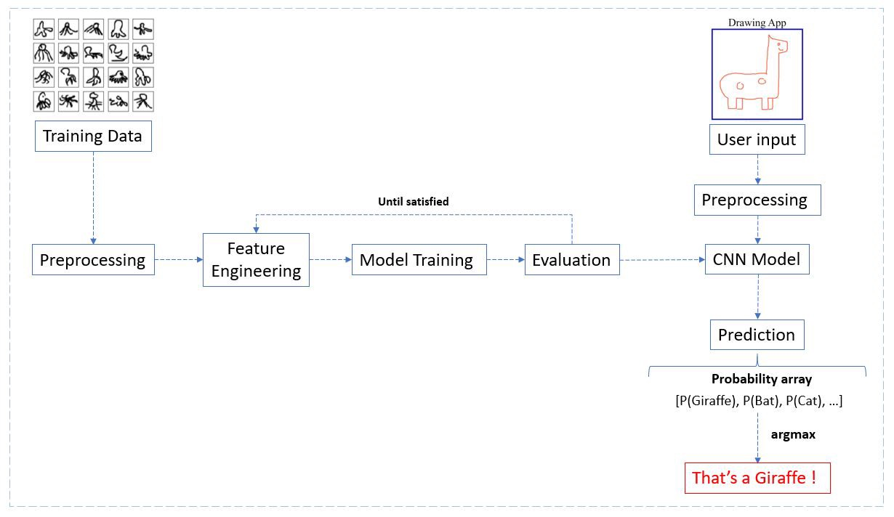
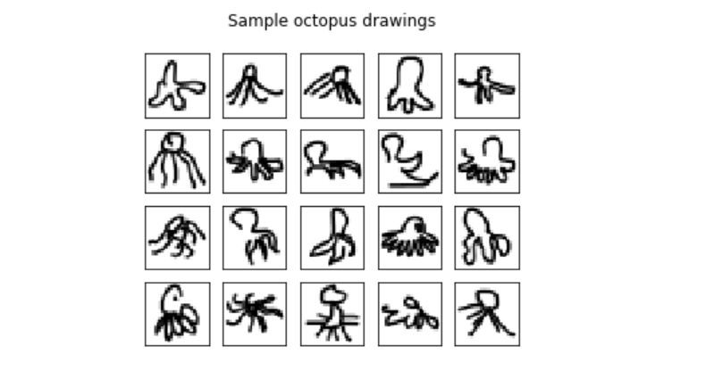
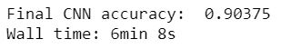
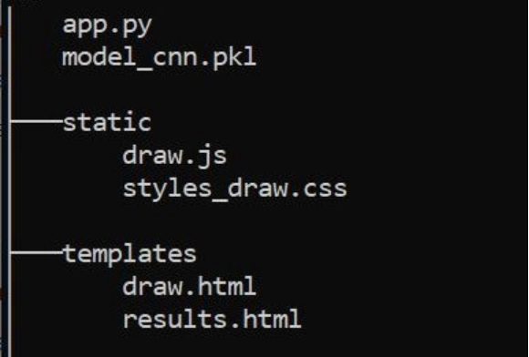
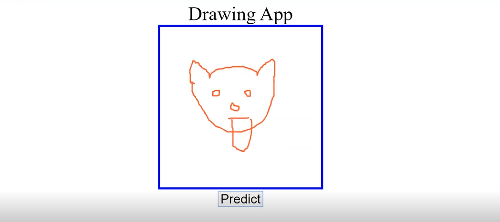
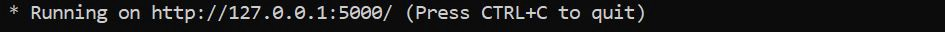
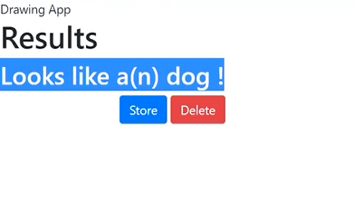

# Image-Classifier

## This Project Focuses on Developing an Interactive Drawing Recognition App based on CNN, and is Deployed it with Flask

Often times, building Machine Learning models ends up being a common task. However, once a certain model has been trained and tested, and the results are satisfactory, what do you do with it next? How would you deploy it online so that it can be used by the other people? This project mainly focuses on training the model and further deploying it. 
I've decided to "create" a drawing application that makes use of a Convolutional Neural Network Model to classify drawings of 6 different classes of animals, drawn by the user.

Given below is the workflow:

## CNN MODEL

The first part of this project is to prepare the data and build our model. The dataset is available here: https://console.cloud.google.com/storage/browser/quickdraw_dataset/full/numpy_bitmap/?pli=1

The 6 classes of animals that I decided to go with are: Cat, Dog, Fish, Giraffe, Camel and Octopus, which makes it a Multiclass Classification.
Here's a small sample of the dataset; a snippet of various hand-drawn figures of an Octopus.

## Preprocessing

The images in this dataset were already preprocessed to a uniform 28 * 28 pixel image size.
The features and labels are then split (X and y).
Finally, we split data between train and test, following the usual 80–20 ratio. We also normalize values between 0 and 1 (X/255) as pixels of a grayscale image lie between 0 and 255.

## Architecture

Our Keras model has the following structure: 

Markup : * Convolutional Layer : 30 filters, (3 * 3) kernel size
         * Max Pooling Layer : (2 * 2) pool size
         * Convolutional Layer : 15 filters, (3 * 3) kernel size
         * Max Pooling Layer : (2 * 2) pool size
         * DropOut Layer : Dropping 20% of neurons.
         * Flatten Layer
         * Dense/Fully Connected Layer : 128 Neurons, Relu activation function
         * Dense/Fully Connected Layer : 50 Neurons, Softmax activation function
         
Once the model structure and architecture is defined, we just need to train it and evaluate its performances. 

After having trained the model, it attains an accuracy of 90.3% after 8 epochs, which is sufficient for our recognition app. 

## Saving the model

Once the model is ready, we'd like to embed it into a Flask Web-App. To do so, it is more convenient to save (serialize) our model using *pickle*. 
The *pickle* library helps in serializing our model, i.e., it converts the model structure and weights to bytes. 

*import pickle
with open('model_cnn.pkl', 'wb') as file:
      pickle.dump(model_cnn, file)* 
      
## Developing our Drawing Web-App with Flask

### Flask

Flask is a web micro-framework written in Python. It allows you to design a solid and professional web application. It usually doesn't require a specific architecture, but it's highly recommended that you use an organized and nuanced template.

**app.py**: It's the main code that will run our Flask application. It will contain the different routes for our application, respond to HTTP requests and decide what to display in the templates. In our case, it will also call our CNN classifier, operate pre-processing steps for our input data and make prediction.

**Templates folder**: A template is an HTML file which can receive Python objects and is linked to the Flask application. Hence, our html pages will be stored in this folder.

**Static folder**:  Style sheets, scripts, images and other elements that aren't generated dynamically are usually be stored in this folder. Our JavaScript and CSS files are placed in it. 

This is how the template looks like:

## Get the user Input

The second part of this project is to get the user input - a hand-drawn figure that will be classified by our trained model. In order to do so, we'll have to first design the drawing area (canvas) using javascript and HTML. The codes to these have been uploaded in the repository.

Markup : * We import our css and js files located in the static folder using Jinja.
         * Our drawing canvas is set up with the <canvas> tag.
         * We call the drawCanvas() javascript function contained in draw.js.
         * We initialize our form so we can use the POST method to send data to our flask instance/app.py.
         * action = “{{url_for('predict')}” is again Jinja syntax. It specifies the path that will be used in app.py when submitting the form.
         * We add an extra hidden field to our form which will be used to transfer the image.<input type = “hidden“ id =’url' name = ‘url' value = “”>
  
  The JavaScript code makes it more dynamic and allows us design and interact with our drawing area.
  
  After completing the aforementioned, the canvas looks like this: 
  
  
  
  Now that our canvas is ready to get the user’s drawing, we need to ensure that the image will be able to reach our app in app.py.
  
  ## Make Predictions
  
Once we're able to get the user input, what's left is to be able to predict it. In order to do so, we define our **app.py** file.

### app.py 
As stated earlier, **app.py** is our project’s main file in which the Flask application is instanciated. 
The code can be found in the repository. 
Once the app is defined with the necessary routes, it leaves us with having to display our results. 

## Display the Results
## results.html
The **results.html** file is used to display the prediction computed in **app.py**. 

Once this is done, all that's left is to run the app. By default, it'll run on your local server *127.0.0.1:5000*. 

 
 
 
 
 
 
 
 
 
 
 

